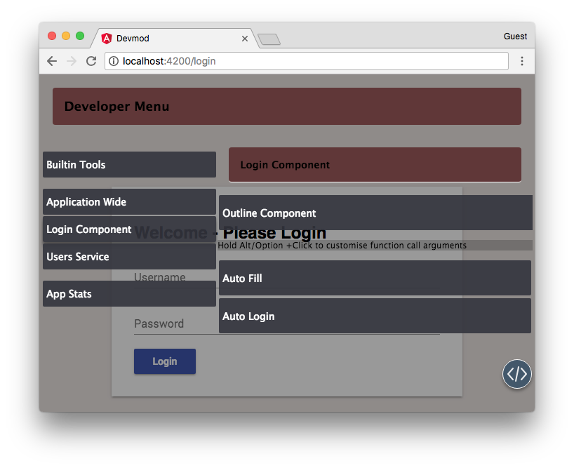
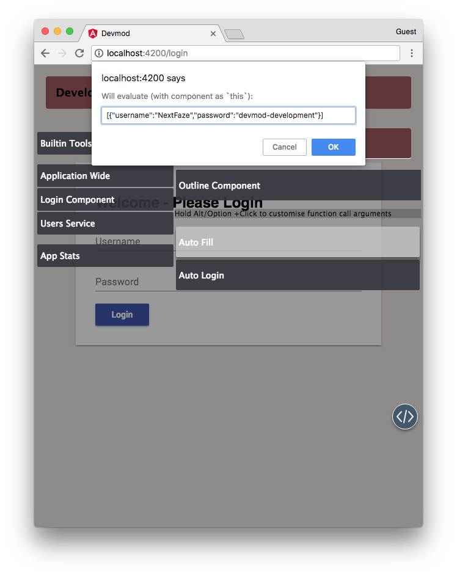
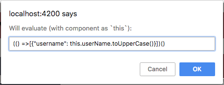

### <devmod-list>

The component that is summoned when the devmod toggle is clicked.



The list is also responsible for a few of the internal features provided by devmod such as

* Providing the "Outline component" functionality
* Running the actual methods on a component instance

## Customising arguments on the fly

You can hold Option or Alt when clicking on a developer function button to be prompted with the `args` variable that will be passed to the method. The string will be `eval()`'d with the component instance as `this` so you can pass IIFEs to get calculated values.

The `eval`d string should return an array of arguments to be passed to the method.

### Invoking a developer method with custom arguments



### Using an IIFE for calculated values



## Replacing the list component

The component class that is summoned by `<devmod-toggle>` is done with an Injection Token. This means that you can completely replace the devmod list component with your own developer interface if you wish:

app.module.ts

```ts
import { DevmodInterfaceModule, DevmodModal } from '@devmod/interface';
import { MyCustomDeveloperInterface } from './my-custom-developer-interface.component.ts';

@NgModule({
  imports: [DevmodInterfaceModule],
  declarations: [MyCustomDeveloperInterface],
  entryComponents: [MyCustomDeveloperInterface],
  providers: [
    {
      provide: DevmodModal,
      useValue: MyCustomDeveloperInterface
    }
  ]
})
export class AppModule {}
```
